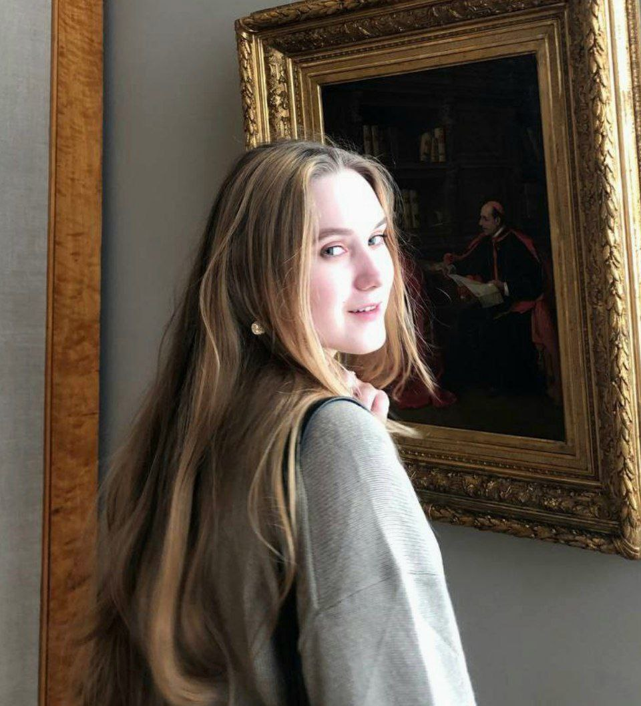

# Veronika Strelkova

## Contacts
* E-mail: mrdraushtam@mail.ru
* Phone: +79005614250
* GitHub: mrdraushtam
* Discord: mrdraushtam
## About me
I am a 4th year student at the university. And now I understand that I need more knowledge and skills for a good and relevant job, so I started learning coding a few months ago. I started by studying at Free Code Camp, and now I'm studying at RS School.
## Skills
* HTML
* CSS
* Git, GitHub
## Code example:
```python
def multiply(a, b):
  return  (a * b)
  ```
## Work experince 
I don't have work experience yet. 
## Education
* **University:** Baltic Federal University named after I. Kant;
* **Courses:** [Free Code Camp](https://www.freecodecamp.org/learn/), [RS School](https://rs.school/).
## Language 
* Russian - native;
* English - B1-B2;


